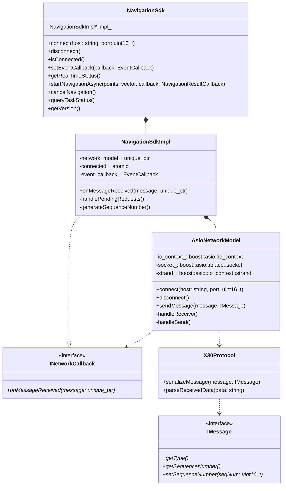
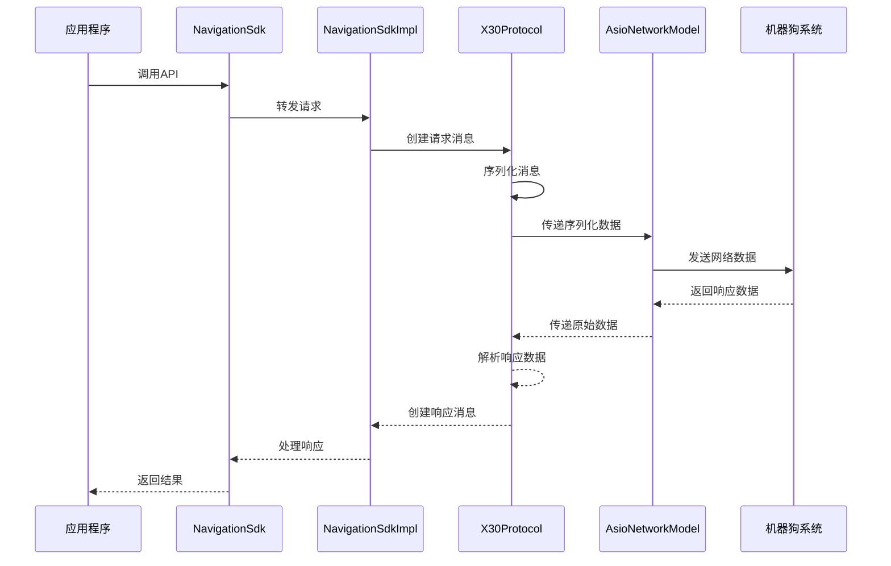

# SDK 架构概述

X30 机器狗导航 SDK 采用了模块化、分层的架构设计，使其具有良好的可维护性、可扩展性和可测试性。本文档将介绍 SDK 的整体架构和各个组件的功能。

## 整体架构

SDK 的整体架构采用了经典的 MVC（Model-View-Controller）设计模式，分为以下几个主要层次：

1. **接口层（Interface Layer）**：提供给用户的公共 API，定义在 `include/` 目录下
2. **控制层（Controller Layer）**：实现业务逻辑，协调各个组件的工作
3. **网络层（Network Layer）**：负责与机器狗控制系统的网络通信
4. **协议层（Protocol Layer）**：处理消息的序列化和反序列化
5. **数据模型层（Model Layer）**：定义数据结构和类型

下图展示了 SDK 的整体架构：

```
┌─────────────────────────────────────────────────────────────┐
│                      应用程序（Application）                  │
└───────────────────────────┬─────────────────────────────────┘
                            │
┌───────────────────────────▼─────────────────────────────────┐
│                        接口层（Interface Layer）              │
│                                                             │
│                     NavigationSdk 类                         │
└───────────────────────────┬─────────────────────────────────┘
                            │
┌───────────────────────────▼─────────────────────────────────┐
│                      控制层（Controller Layer）               │
│                                                             │
│                    NavigationSdkImpl 类                      │
└─┬─────────────────────────┬────────────────────────────────┬┘
  │                         │                                │
┌─▼─────────────────┐ ┌─────▼──────────────┐ ┌───────────────▼─┐
│   网络层（Network） │ │   协议层（Protocol）  │ │ 数据模型层（Model）│
│                   │ │                    │ │                 │
│ AsioNetworkModel  │ │    X30Protocol     │ │  各种数据结构和类型  │
└───────────────────┘ └────────────────────┘ └─────────────────┘
```

## 组件详解

### 1. 接口层（Interface Layer）

接口层定义了 SDK 对外提供的公共 API，主要包括：

- **NavigationSdk 类**：SDK 的主要入口点，提供所有功能的访问接口
- **类型定义**：定义了各种数据结构、枚举类型和回调函数类型

接口层的代码位于 `include/` 目录下：

- `navigation_sdk.h`：定义 NavigationSdk 类及其方法
- `types.h`：定义各种数据结构和类型

### 2. 控制层（Controller Layer）

控制层实现了 SDK 的核心业务逻辑，负责协调各个组件的工作：

- **NavigationSdkImpl 类**：NavigationSdk 类的实际实现，管理网络连接、消息处理和状态维护
- **实现网络回调接口**：处理从网络层接收到的消息
- **管理请求和响应**：跟踪请求和响应的对应关系，处理超时和错误

控制层的代码位于 `src/navigation_sdk.cpp` 文件中。

### 3. 网络层（Network Layer）

网络层负责与机器狗控制系统的网络通信，主要包括：

- **BaseNetworkModel 类**：定义网络模型的基本接口
- **AsioNetworkModel 类**：基于 Boost.Asio 的网络实现，提供异步 TCP 通信功能
- **INetworkCallback 接口**：定义网络事件的回调接口

网络层的代码位于 `src/network/` 目录下：

- `base_network_model.hpp`：定义网络模型的基本接口
- `asio_network_model.hpp` 和 `asio_network_model.cpp`：实现基于 Boost.Asio 的网络模型

### 4. 协议层（Protocol Layer）

协议层处理消息的序列化和反序列化，支持 XML 和 JSON 两种格式：

- **IMessage 接口**：定义消息的基本接口
- **X30Protocol 类**：实现 X30 协议的解析和生成
- **各种消息类**：实现不同类型的请求和响应消息

协议层的代码位于 `src/protocol/` 目录下：

- `message_interface.hpp` 和 `message_interface.cpp`：定义消息的基本接口
- `messages.hpp` 和 `messages.cpp`：定义各种消息类型
- `x30_protocol.hpp` 和 `x30_protocol.cpp`：实现 X30 协议的处理

### 5. 数据模型层（Model Layer）

数据模型层定义了 SDK 使用的各种数据结构和类型：

- **NavigationPoint**：导航点的数据结构
- **RealTimeStatus**：实时状态的数据结构
- **NavigationResult**：导航任务结果的数据结构
- **TaskStatusResult**：任务状态结果的数据结构
- **各种枚举类型**：如 ErrorCode、NavigationStatus、EventType 等

数据模型层的代码分布在 `include/types.h` 和 `src/protocol/messages.hpp` 文件中。

## 类图

类图说明：

1. **NavigationSdk** 是 SDK 的主要入口点，通过 PIMPL 模式封装了具体实现
2. **NavigationSdkImpl** 实现了核心业务逻辑，并实现了 INetworkCallback 接口
3. **AsioNetworkModel** 是基于 Boost.Asio 的具体网络实现
4. **IMessage** 是所有消息类型的基础接口
5. **X30Protocol** 负责消息的序列化和反序列化

关系说明：
- `*--` 表示组合关系（实心菱形）
- `--|>` 表示继承关系（空心三角形）
- `..|>` 表示接口实现（虚线空心三角形）
- `..>` 表示依赖关系（虚线箭头）

## 数据流

以下是 SDK 中数据流的基本流程：

1. **发送请求**：
   - 用户调用 NavigationSdk 的方法
   - NavigationSdkImpl 创建对应的请求消息
   - X30Protocol 序列化消息
   - AsioNetworkModel 发送序列化后的数据

2. **接收响应**：
   - AsioNetworkModel 接收网络数据
   - X30Protocol 解析数据并创建响应消息
   - NavigationSdkImpl 处理响应消息
   - 结果返回给用户或通过回调函数通知用户

3. **时序图**


## 设计特点

SDK 的设计具有以下特点：

1. **模块化设计**：各个组件职责明确，相互独立，便于维护和扩展
2. **接口分离**：通过接口定义组件之间的交互，降低耦合度
3. **异步处理**：支持同步和异步两种操作方式，提高灵活性
4. **线程安全**：采用多种线程同步机制，确保多线程环境下的安全性
5. **错误处理**：完善的错误处理和恢复机制，提高系统稳定性
6. **可测试性**：组件之间通过接口交互，便于单元测试和集成测试

## 扩展性

SDK 的架构设计考虑了未来的扩展需求：

1. **支持新的消息类型**：只需在协议层添加新的消息类，无需修改其他组件
2. **支持新的网络协议**：可以实现新的 BaseNetworkModel 子类，无需修改控制层
3. **支持新的序列化格式**：可以扩展 X30Protocol 类或实现新的协议处理类

## 总结

X30 机器狗导航 SDK 采用了模块化、分层的架构设计，各个组件职责明确，相互独立，具有良好的可维护性、可扩展性和可测试性。通过清晰的接口定义和完善的错误处理机制，SDK 提供了稳定、可靠的机器狗导航控制功能。
