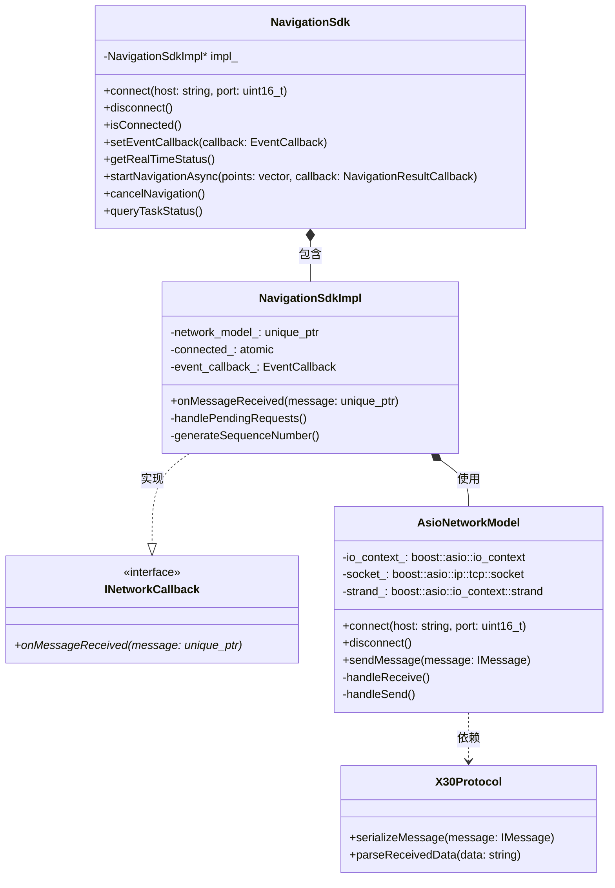
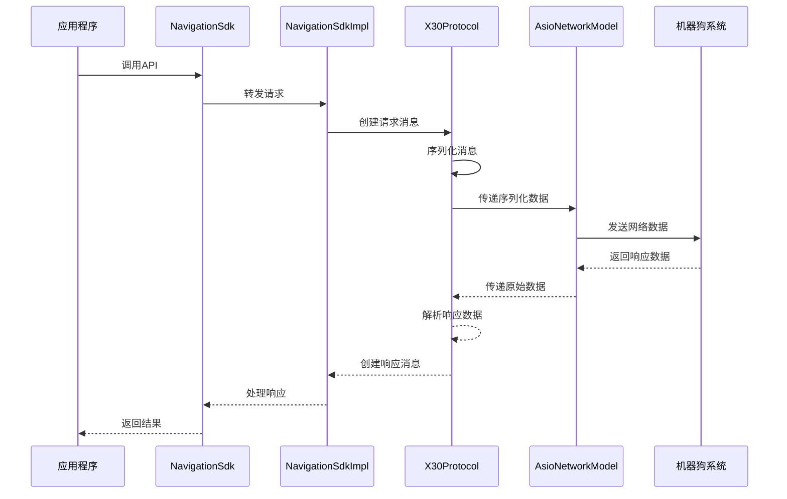

# X30 机器狗导航 SDK 架构设计

## 1. 架构概述

X30 机器狗导航 SDK 采用**简洁的分层架构**设计，确保系统具有**高可维护性**和**良好扩展性**。本文档简要介绍 SDK 的整体架构和核心组件。

### 1.1 核心层次结构

SDK 由以下三个主要层次组成：

| 层次 | 职责 | 关键组件 |
|------|------|---------|
| **接口层** | 提供用户 API | NavigationSdk 类 |
| **实现层** | 实现业务逻辑 | NavigationSdkImpl 类 |
| **网络层** | 处理网络通信和协议 | AsioNetworkModel 类、X30Protocol 类 |

### 1.2 架构图示

```
┌─────────────────────────────────────────────────────────────┐
│                      应用程序（Application）                  │
└───────────────────────────┬─────────────────────────────────┘
                            │
                            ▼
┌─────────────────────────────────────────────────────────────┐
│                     接口层（Interface Layer）                 │
│                        NavigationSdk 类                      │
└───────────────────────────┬─────────────────────────────────┘
                            │
                            ▼
┌─────────────────────────────────────────────────────────────┐
│                     实现层（Implementation Layer）            │
│                      NavigationSdkImpl 类                    │
└───────────────────────────┬─────────────────────────────────┘
                            │
                            ▼
┌─────────────────────────────────────────────────────────────┐
│                       网络层（Network Layer）                 │
│         AsioNetworkModel 类（网络通信）                       │
│         X30Protocol 类（协议序列化/反序列化）                  │
└─────────────────────────────────────────────────────────────┘
```

## 2. 组件详解

### 2.1 接口层（Interface Layer）

接口层是 SDK 与用户应用程序交互的桥梁，提供简洁易用的 API。

#### 核心组件

- **NavigationSdk 类**：SDK 的主入口点，封装所有功能接口
- **类型定义**：包括数据结构、枚举类型和回调函数类型

#### 代码位置

- `include/navigation_sdk.h`：定义 NavigationSdk 类及其方法
- `include/types.h`：定义各种数据结构和类型

#### 设计特点

- 采用 **PIMPL 模式**（指针实现）隐藏实现细节
- 提供**同步和异步**两种操作方式
- 使用**回调机制**处理异步事件

### 2.2 实现层（Implementation Layer）

实现层是 SDK 的核心，负责业务逻辑实现和各组件协调。

#### 核心组件

- **NavigationSdkImpl 类**：NavigationSdk 的具体实现
- **网络回调接口实现**：处理网络消息
- **请求响应管理**：跟踪请求和响应的对应关系

#### 代码位置

- `src/navigation_sdk.cpp`：实现 NavigationSdkImpl 类

#### 设计特点

- 实现 **INetworkCallback 接口**接收网络消息
- 使用**条件变量**和**互斥锁**确保线程安全
- 管理**请求超时**和**错误处理**

### 2.3 网络层（Network Layer）

网络层负责与机器狗控制系统进行通信，包括网络连接管理和协议处理。

#### 核心组件

- **AsioNetworkModel 类**：基于 Boost.Asio 的网络实现
- **X30Protocol 类**：处理消息的序列化和反序列化
- **INetworkCallback 接口**：定义网络事件回调

#### 代码位置

- `src/network/asio_network_model.hpp/cpp`：网络通信实现
- `src/protocol/x30_protocol.hpp/cpp`：协议处理实现

#### 设计特点

- 基于 **Boost.Asio** 实现**异步 TCP 通信**
- 使用 **Strand** 确保回调的线程安全
- 支持 **XML** 协议格式

## 3. 类图与关系

下面的类图展示了 SDK 主要组件之间的关系：



## 4. 数据流

SDK 中的数据流展示了请求和响应的完整生命周期。

### 4.1 请求流程

1. **用户调用** → 用户通过 NavigationSdk 接口发起请求
2. **请求转发** → NavigationSdkImpl 接收并处理请求
3. **消息创建** → 创建对应的请求消息对象
4. **消息序列化** → X30Protocol 将消息序列化为二进制数据
5. **网络发送** → AsioNetworkModel 通过网络发送数据

### 4.2 响应流程

1. **数据接收** → AsioNetworkModel 接收网络数据
2. **数据解析** → X30Protocol 解析数据并创建响应消息
3. **消息处理** → NavigationSdkImpl 处理响应消息
4. **结果返回** → 结果通过同步返回或异步回调传递给用户

### 4.3 时序图



## 5. 设计特点与优势

### 5.1 核心设计特点

| 特点 | 描述 | 优势 |
|------|------|------|
| **分层设计** | 清晰的三层架构 | 降低耦合，提高可维护性 |
| **接口分离** | 通过接口定义组件交互 | 便于单元测试和模块替换 |
| **异步处理** | 支持同步和异步操作 | 提高系统灵活性和性能 |
| **线程安全** | 多种线程同步机制 | 确保多线程环境安全 |

### 5.2 扩展性设计

SDK 架构设计考虑了未来扩展需求：

1. **新网络协议支持**
   - 实现新的网络模型类
   - 或扩展现有协议处理类

2. **新序列化格式支持**
   - 扩展 X30Protocol 类
   - 或实现新的协议处理类

## 6. 总结

X30 机器狗导航 SDK 采用简洁的三层架构设计，各组件职责明确，相互独立，具有以下优势：

- **高可维护性**：清晰的层次结构和接口定义
- **良好扩展性**：松耦合设计便于添加新功能
- **易用性**：简洁的 API 设计，支持同步和异步操作

通过这种架构设计，SDK 为开发者提供了稳定、可靠、易用的机器狗导航控制功能，同时保持了系统的灵活性和可扩展性。
