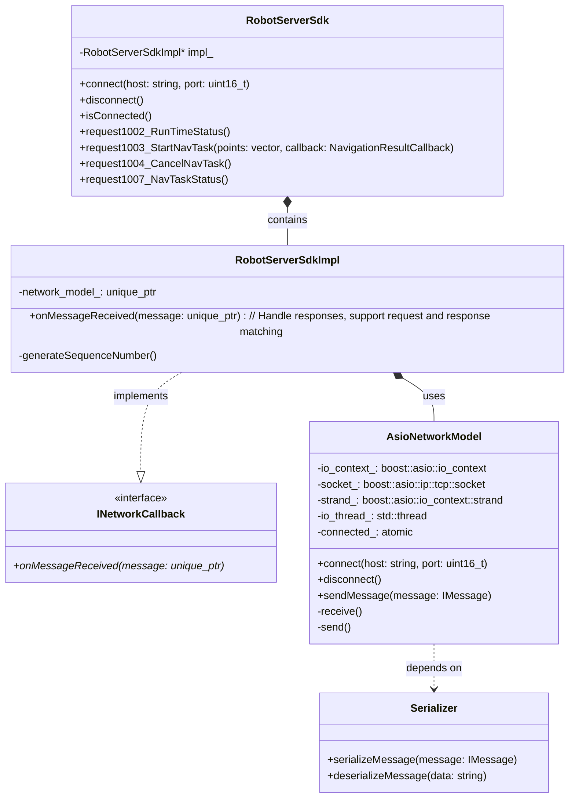
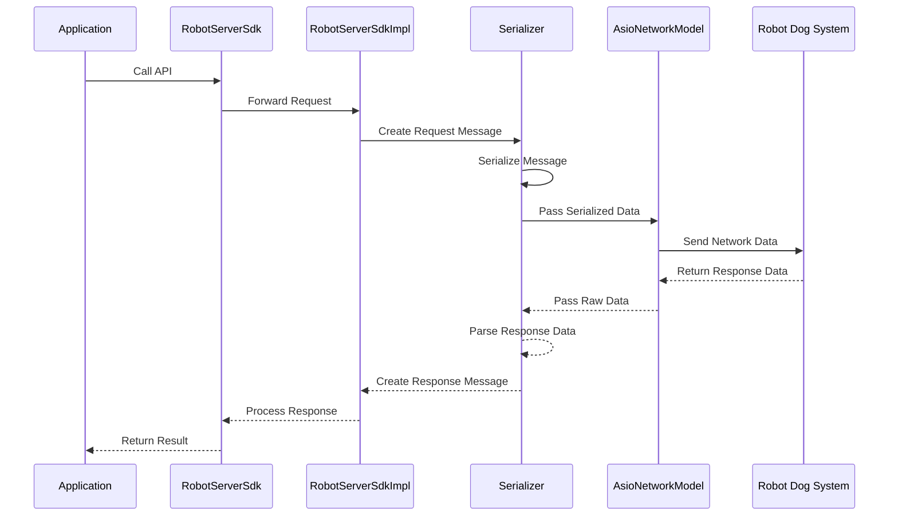
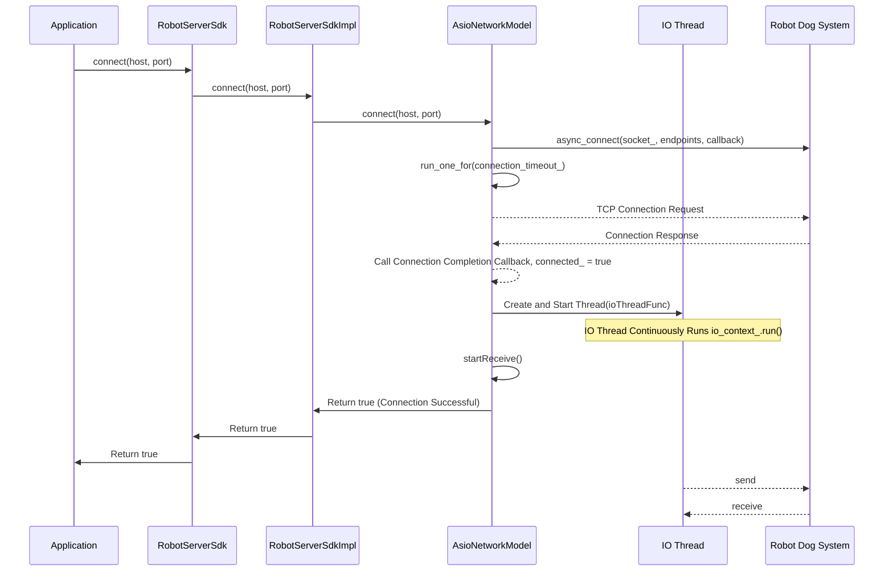
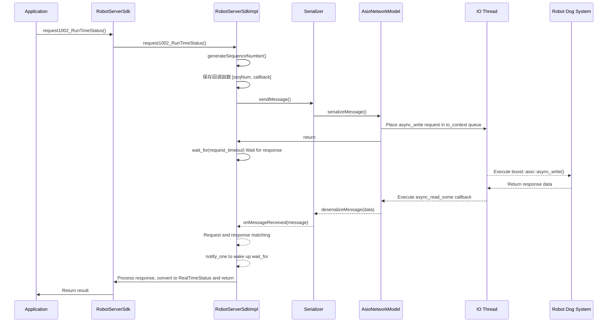
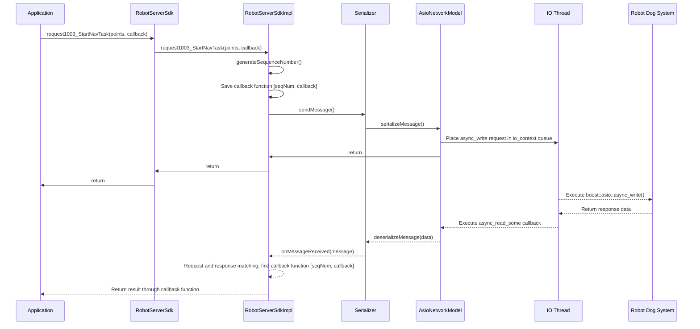

# Robot Dog RobotServer SDK Architecture Design

## 1. Architecture Overview

The Robot Dog RobotServer SDK adopts a **simple layered architecture** design, ensuring that the system has **high maintainability** and **good extensibility**. This document briefly introduces the overall architecture and core components of the SDK.

### 1.1 Core Layer Structure

The SDK consists of the following three main layers:

| Layer | Responsibility | Key Components |
|------|------|---------|
| **Application Layer** | Responsible for calling interfaces provided by the interface layer, integrating business logic | ___ |
| **Interface Layer** | Responsible for request/response management, providing functional interfaces | RobotServerSdk class, RobotServerSdkImpl class |
| **Communication Layer** | Responsible for protocol serialization, data transmission | AsioNetworkModel class, Serializer class |

### 1.2 Architecture Diagram

```
┌────────────────────────────────────────────────────────────────────────┐
│                          【Application Layer】                           │
│     Main Function: Responsible for calling interfaces provided by       │
│                    the interface layer, integrating business logic      │
└────────────────────────────────┬───────────────────────────────────────┘
                                 │
                                 ▼
┌────────────────────────────────────────────────────────────────────────┐
│                         【Interface Layer】                              │
│     Main Function: Responsible for request/response management,         │
│                    providing functional interfaces                      │
│     Key Classes: RobotServerSdk class, RobotServerSdkImpl class         │
└────────────────────────────────┬───────────────────────────────────────┘
                                 │
                                 ▼
┌────────────────────────────────────────────────────────────────────────┐
│                      【Communication Layer】                             │
│     Main Function: Responsible for protocol serialization,              │
│                    data transmission                                    │
│     Key Classes: Serializer class (protocol serialization/              │
│                  deserialization), AsioNetworkModel class               │
│                  (network communication)                                │
└────────────────────────────────────────────────────────────────────────┘
```

## 2. Component Details

### 2.1 Interface Layer

The interface layer is the bridge between the SDK and user applications, providing simple and easy-to-use APIs, while being responsible for business logic implementation and component coordination.

#### Core Components

- **RobotServerSdk Class**: The main entry point of the SDK, encapsulating all functional interfaces
- **RobotServerSdkImpl Class**: The concrete implementation of RobotServerSdk
- **Type Definitions**: Including data structures, enumeration types, and callback function types
- **Network Callback Interface Implementation**: Handling network messages
- **Request Response Management**: Tracking the correspondence between requests and responses

#### Code Location

- `include/robotserver_sdk.h`: Defines the RobotServerSdk class and its methods
- `include/types.h`: Defines various data structures and types
- `src/robotserver_sdk.cpp`: Implements the RobotServerSdkImpl class

#### Design Features

- Uses the **PIMPL pattern** (Pointer to Implementation) to hide implementation details
- Provides both **synchronous and asynchronous** operation modes
- Uses a **callback mechanism** to handle asynchronous events
- Implements the **INetworkCallback interface** to receive network messages
- Uses **condition variables** and **mutexes** to ensure thread safety
- Manages **request timeouts** and **error handling**

### 2.2 Communication Layer

The communication layer is responsible for communicating with the robot dog control system, including network connection management and protocol handling.

#### Core Components

- **Serializer Class**: Handles message serialization and deserialization
- **AsioNetworkModel Class**: Network implementation based on Boost.Asio
- **INetworkCallback Interface**: Defines the network layer callback interface

#### Code Location

- `src/protocol/serializer.hpp/cpp`: Protocol handling implementation
- `src/network/asio_network_model.hpp/cpp`: Network communication implementation

#### Design Features

- Implements **asynchronous TCP communication** based on **Boost.Asio**
- Uses **Strand** to ensure thread safety of callbacks
- Supports **XML** protocol format

## 3. Class Diagram and Relationships

The following class diagram shows the relationships between the main components of the SDK:



## 4. Data Flow

The data flow in the SDK shows the complete lifecycle of requests and responses.

### 4.1 Request Process

1. **User Call** → User initiates a request through the RobotServerSdk interface
2. **Request Forwarding** → RobotServerSdkImpl receives and processes the request
3. **Message Creation** → Creates the corresponding request message object
4. **Message Serialization** → Serializer serializes the message into binary data
5. **Network Sending** → AsioNetworkModel sends the data over the network

### 4.2 Response Process

1. **Data Reception** → AsioNetworkModel receives network data
2. **Data Parsing** → Serializer parses the data and creates a response message
3. **Message Processing** → RobotServerSdkImpl processes the response message
4. **Result Return** → Results are passed to the user through synchronous return or asynchronous callback

### 4.3 Sequence Diagram



### 4.4 Connect Process

Solid arrows represent user threads; during connection, dashed arrows depend on the system's underlying IO; when sending and receiving data, dashed arrows represent IO threads




### 4.5 Request Process (Synchronous) 1002, 1004, 1007

Solid arrows represent user threads, dashed arrows represent IO threads



### 4.6 Request Process (Asynchronous) 1003

Solid arrows represent user threads, dashed arrows represent IO threads



## 5. Design Features and Advantages

### 5.1 Core Design Features

| Feature | Description | Advantage |
|------|------|------|
| **Layered Design** | Clear three-layer architecture | Reduces coupling, improves maintainability |
| **Interface Separation** | Component interaction defined through interfaces | Facilitates unit testing and module replacement |
| **Asynchronous Processing** | Supports both synchronous and asynchronous operations | Improves system flexibility and performance |
| **Thread Safety** | Multiple thread synchronization mechanisms | Ensures safety in multi-threaded environments |

### 5.2 Extensibility Design

The SDK architecture design considers future extension needs:

1. **Support for New Network Protocols**
   - Implement new network model classes
   - Or extend existing protocol handling classes

2. **Support for New Serialization Formats**
   - Extend the Serializer class
   - Or implement new protocol handling classes

## 6. Summary

The Robot Dog RobotServer SDK adopts a simple three-layer architecture design, with clear responsibilities and independence between components, offering the following advantages:

- **High Maintainability**: Clear hierarchical structure and interface definitions
- **Good Extensibility**: Loosely coupled design facilitates adding new features
- **Ease of Use**: Simple API design, supports both synchronous and asynchronous operations

Through this architecture design, the SDK provides developers with stable, reliable, and easy-to-use robot dog control functionality, while maintaining system flexibility and extensibility.

## Next Steps

- Check out the [Quick Start Guide](quick_start.en.md) to understand the overall architecture and design philosophy of the SDK
- Check out the [API Reference](api_reference.en.md) to learn more about SDK functions

