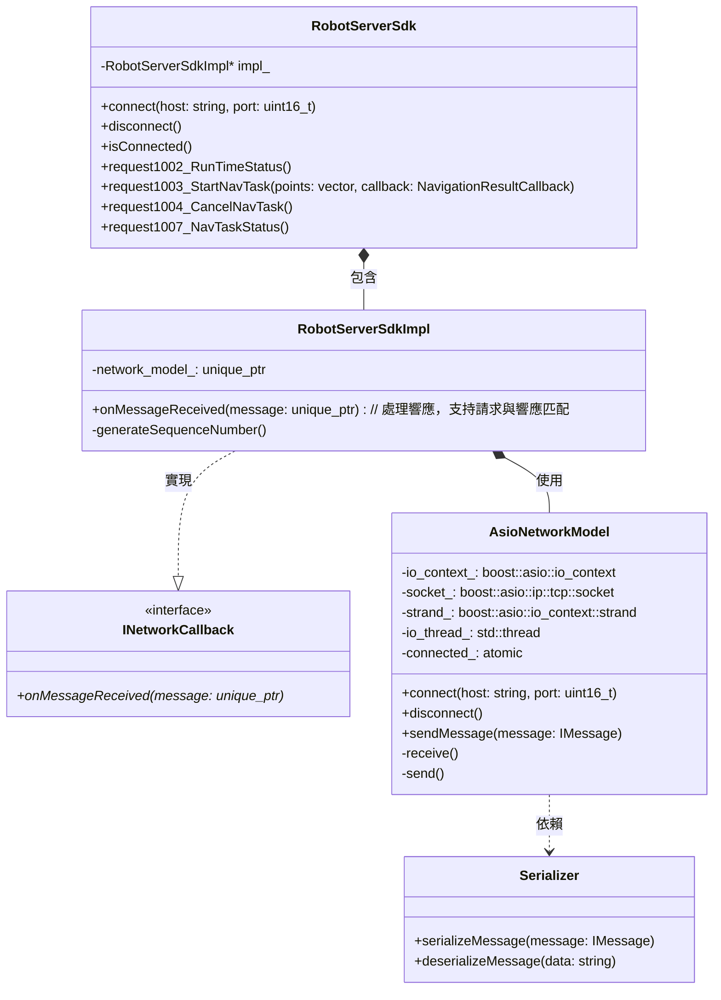
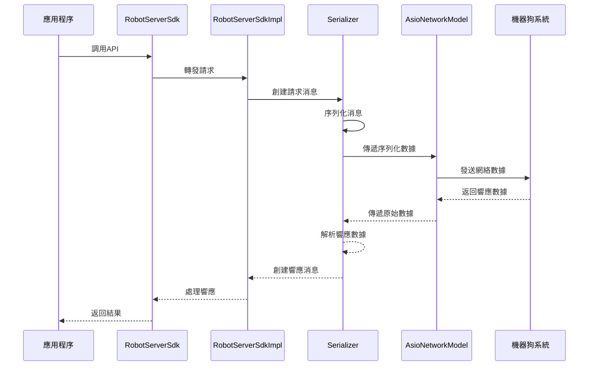
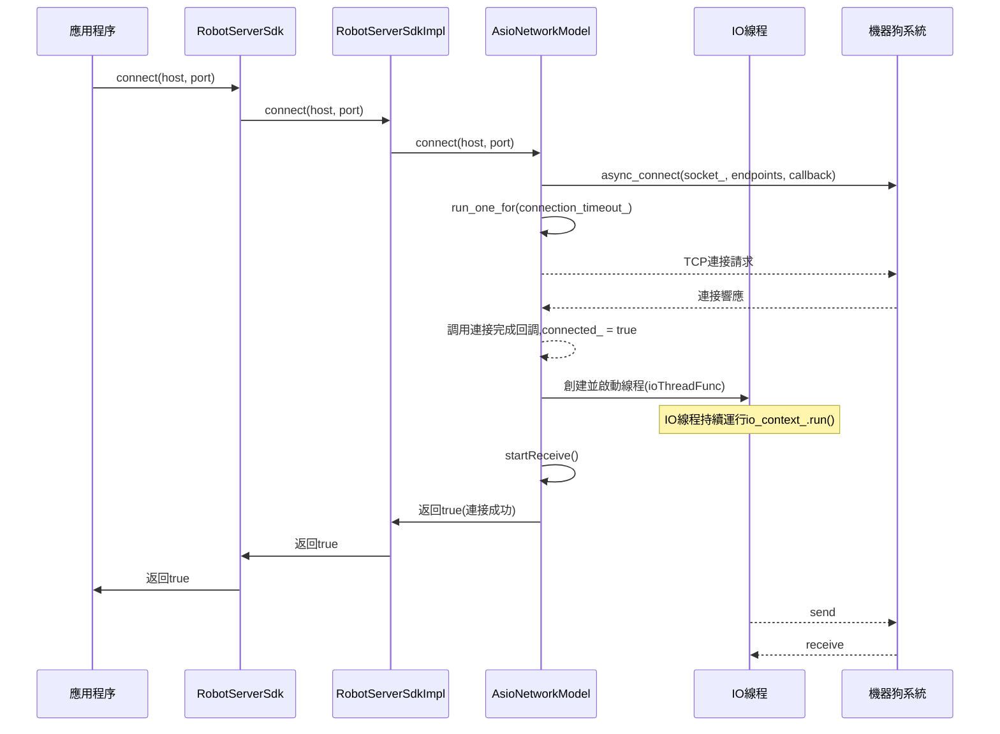
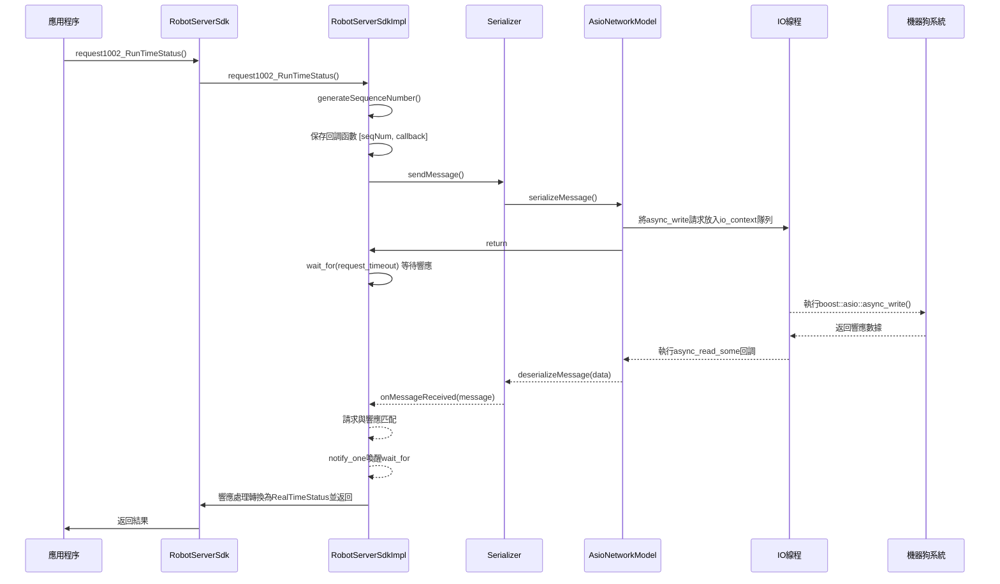
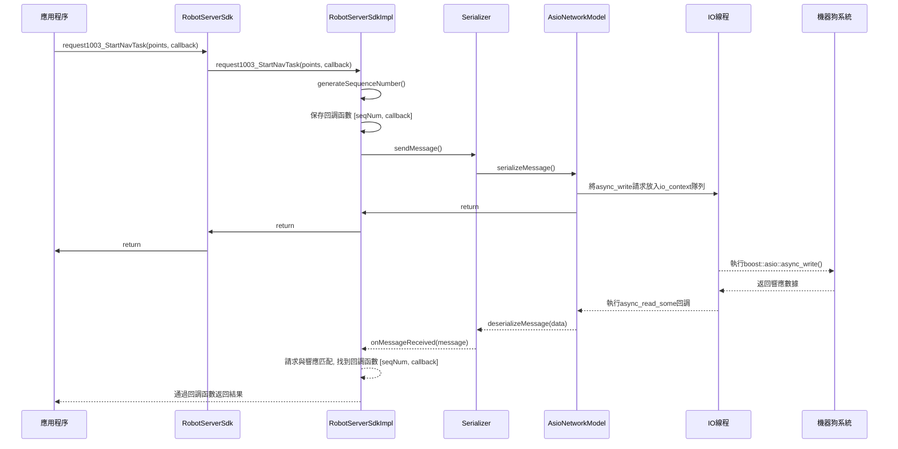

# 機器狗RobotServer SDK 架構設計

## 1. 架構概述

機器狗RobotServer SDK 採用**簡潔的分層架構**設計，確保系統具有**高可維護性**和**良好擴展性**。本文檔簡要介紹 SDK 的整體架構和核心組件。

### 1.1 核心層次結構

SDK 由以下三個主要層次組成：

| 層次 | 職責 | 關鍵組件 |
|------|------|---------|
| **應用層** | 負責調用接口層提供的接口，集成實現業務邏輯 | ___ |
| **接口層** | 負責請求/響應的管理，對外提供功能接口 | RobotServerSdk 類、RobotServerSdkImpl 類 |
| **通信層** | 負責協議序列化，數據傳輸 | AsioNetworkModel 類、Serializer 類 |

### 1.2 架構圖示

```
┌────────────────────────────────────────────────────────────────────────┐
│                          【應用層（Application）】                        │
│                主要功能：負責調用接口層提供的接口，集成實現業務邏輯             │
└────────────────────────────────┬───────────────────────────────────────┘
                                 │
                                 ▼
┌────────────────────────────────────────────────────────────────────────┐
│                         【接口層（Interface Layer）】                     │
│               主要功能：負責請求/響應的管理，對外提供功能接口                  │
│               關鍵類：RobotServerSdk 類，RobotServerSdkImpl 類           │
└────────────────────────────────┬───────────────────────────────────────┘
                                 │
                                 ▼
┌────────────────────────────────────────────────────────────────────────┐
│                      【通信層（Communication Layer）】                    │
│                    主要功能：負責協議序列化，數據傳輸                        │
│   關鍵類：Serializer 類（協議序列化/反序列化），AsioNetworkModel 類（網絡通信） │
└────────────────────────────────────────────────────────────────────────┘
```

## 2. 組件詳解

### 2.1 接口層（Interface Layer）

接口層是 SDK 與用戶應用程序交互的橋梁，提供簡潔易用的 API，同時負責業務邏輯實現和各組件協調。

#### 核心組件

- **RobotServerSdk 類**：SDK 的主入口點，封裝所有功能接口
- **RobotServerSdkImpl 類**：RobotServerSdk 的具體實現
- **類型定義**：包括數據結構、枚舉類型和回調函數類型
- **網絡回調接口實現**：處理網絡消息
- **請求響應管理**：跟蹤請求和響應的對應關係

#### 代碼位置

- `include/robotserver_sdk.h`：定義 RobotServerSdk 類及其方法
- `include/types.h`：定義各種數據結構和類型
- `src/robotserver_sdk.cpp`：實現 RobotServerSdkImpl 類

#### 設計特點

- 採用 **PIMPL 模式**（指針實現）隱藏實現細節
- 提供**同步和異步**兩種操作方式
- 使用**回調機制**處理異步事件
- 實現 **INetworkCallback 接口**接收網絡消息
- 使用**條件變量**和**互斥鎖**確保線程安全
- 管理**請求超時**和**錯誤處理**

### 2.2 通信層（Communication Layer）

通信層負責與機器狗控制系統進行通信，包括網絡連接管理和協議處理。

#### 核心組件

- **Serializer 類**：處理消息的序列化和反序列化
- **AsioNetworkModel 類**：基於 Boost.Asio 的網絡實現
- **INetworkCallback 接口**：定義網絡層回調接口

#### 代碼位置

- `src/protocol/serializer.hpp/cpp`：協議處理實現
- `src/network/asio_network_model.hpp/cpp`：網絡通信實現

#### 設計特點

- 基於 **Boost.Asio** 實現**異步 TCP 通信**
- 使用 **Strand** 確保回調的線程安全
- 支持 **XML** 協議格式

## 3. 類圖與關係

下面的類圖展示了 SDK 主要組件之間的關係：



## 4. 數據流

SDK 中的數據流展示了請求和響應的完整生命週期。

### 4.1 請求流程

1. **用戶調用** → 用戶通過 RobotServerSdk 接口發起請求
2. **請求轉發** → RobotServerSdkImpl 接收並處理請求
3. **消息創建** → 創建對應的請求消息對象
4. **消息序列化** → Serializer 將消息序列化為二進制數據
5. **網絡發送** → AsioNetworkModel 通過網絡發送數據

### 4.2 響應流程

1. **數據接收** → AsioNetworkModel 接收網絡數據
2. **數據解析** → Serializer 解析數據並創建響應消息
3. **消息處理** → RobotServerSdkImpl 處理響應消息
4. **結果返回** → 結果通過同步返回或異步回調傳遞給用戶

### 4.3 時序圖



### 4.4 connect 流程

實線箭頭表示用戶線程; 連接時期虛線箭頭依賴系統底層IO; 收發數據時虛線箭頭表示IO線程




### 4.5 請求流程(同步) 1002, 1004, 1007

實線箭頭表示用戶線程，虛線箭頭表示IO線程



### 4.6 請求流程(異步) 1003

實線箭頭表示用戶線程，虛線箭頭表示IO線程



## 5. 設計特點與優勢

### 5.1 核心設計特點

| 特點 | 描述 | 優勢 |
|------|------|------|
| **分層設計** | 清晰的三層架構 | 降低耦合，提高可維護性 |
| **接口分離** | 通過接口定義組件交互 | 便於單元測試和模塊替換 |
| **異步處理** | 支持同步和異步操作 | 提高系統靈活性和性能 |
| **線程安全** | 多種線程同步機制 | 確保多線程環境安全 |

### 5.2 擴展性設計

SDK 架構設計考慮了未來擴展需求：

1. **新網絡協議支持**
   - 實現新的網絡模型類
   - 或擴展現有協議處理類

2. **新序列化格式支持**
   - 擴展 Serializer 類
   - 或實現新的協議處理類

## 6. 總結

機器狗RobotServer SDK 採用簡潔的三層架構設計，各組件職責明確，相互獨立，具有以下優勢：

- **高可維護性**：清晰的層次結構和接口定義
- **良好擴展性**：鬆耦合設計便於添加新功能
- **易用性**：簡潔的 API 設計，支持同步和異步操作

通過這種架構設計，SDK 為開發者提供了穩定、可靠、易用的機器狗控制功能，同時保持了系統的靈活性和可擴展性。

## 下一步

- 查看 [快速入門](quick_start.zh-TW.md) 了解 SDK 的整體架構和設計理念
- 查看 [API 參考](api_reference.zh-TW.md) 了解更多 SDK 功能
